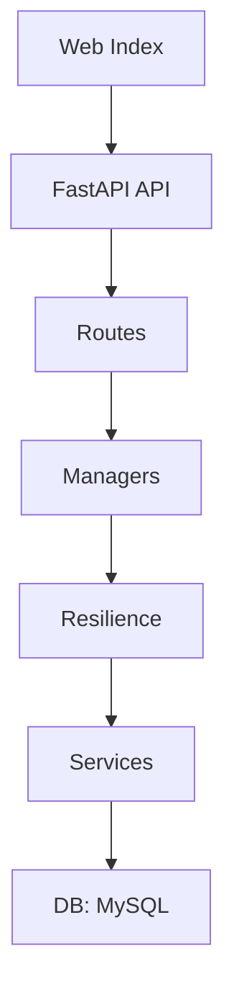

## Sensor Meteorológico

### Executive Summary
- **Project Objective**: API y sistema para gestión y auditoría de sensores meteorológicos.
- **Scope**: Backend FastAPI, base de datos MySQL, pruebas unitarias, estructura modular.
- **Team / Roles**: Backend, QA, DevOps, Product Owner.
- **Status**: ⚠️ Falta integración DB real, CI/CD y frontend.

### Architecture & Technology Stack
- **Frontend**: Web estática (no documentada).
- **Backend**: FastAPI, modular (routes, services, managers, resilience).
- **Databases**: MySQL (jenkins, SensorData).
- **Infrastructure**: Linux, Uvicorn, ⚠️ Sin Docker/K8s.
- **CI/CD Tools**: ⚠️ No documentado.

### Workflows & Processes
- **Development**: Edición modular, pruebas unitarias, validación con pytest.
- **Testing**: Pruebas unitarias en `api/tests/`.
- **Deployment**: `uvicorn api.main:app --reload`. ⚠️ Sin proceso productivo documentado.
- **Monitoring & Logging**: ⚠️ No implementado.

### Visual Components
#### Tablas
| Tabla        | Campos principales                                   |
|--------------|------------------------------------------------------|
| audit        | id, Aplication, Date, Repository, End, Branch        |
| despliegues  | id, Aplication, Date, Repository, Ends, Branch, Path, ServerName |
| data         | id, Temperatura, Posicion, Nombre, Fecha             |
| sensor       | Name, Batery, Estado                                 |

#### Endpoints API
| Método   | Endpoint           | Descripción                  |
|----------|--------------------|------------------------------|
| GET      | /sensors           | Lista todos los sensores     |
| GET      | /sensors/{id}      | Consulta sensor por ID       |
| POST     | /sensors           | Crea nuevo sensor            |

### Improvement Recommendations
- Integrar DB real, Docker, logging, monitoreo, CI/CD, validaciones, ejemplos, README por carpeta.
